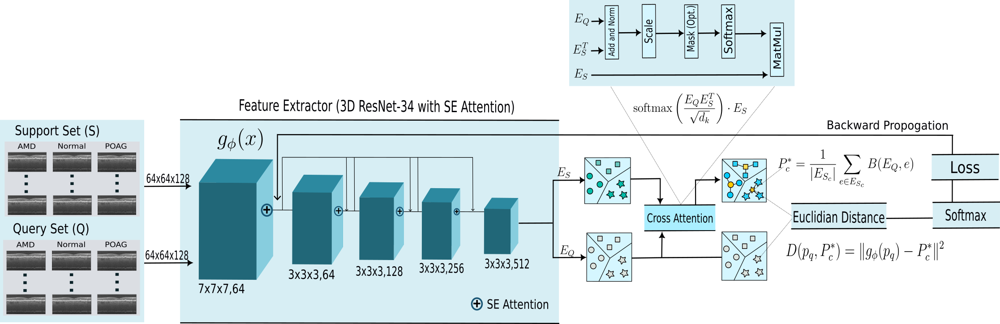

# CAP-FSL



## Requirements

To utilize this repository, ensure that the following software requirements are met:

- `torch==1.13.1`
- `numpy==1.23.5`
- `matplotlib==3.7.0`
- `scipy==1.9.1`
- `sklearn==1.2.1`
- `python==3.9.16`

Please make sure to have the specific versions installed to ensure compatibility with the code.

## Datasets

The datasets used in this project can be found at the following locations:

- AMD: [Link to AMD dataset](https://people.duke.edu/~sf59/RPEDC_Ophth_2013_dataset.htm)
- POAG and Normal: [Link to POAG and Normal dataset](https://zenodo.org/records/1481223)


## Installation

Clone this repository to your local machine using:

```bash
git clone <repository-url>
cd <repository-name>
```

## Installation

To get started, clone this repository to your local machine:

```bash
git clone <repository-url>
cd <repository-name>
```

## Preprocessing
Prepare your dataset by resizing and converting it to numpy format. Run the preprocessing script:
```bash
python preprocess.py
```

## Training
The training scripts for CAP-FSL, Prototypical Few-Shot Learning, Matching Network, and Deep Subspace Network are located in the Train folder. To begin training, execute:
```bash
python -m Train.CAP_train
```
This will start the training process and save the best model in the Models folder.

## Inference
For inference, go to the Test folder and run:
```bash
python -m Test.CAP_test
```

Update the path in the test script to load the saved model. Ensure the data and model paths are correctly set in the script's path variables.

## Additional Information

    Loss functions and other supportive files are included in the setup script.
    The architecture for 3D ResNet34 with SE attention is outlined in the resnet script.
    Data loaders specifically designed for the few-shot learning scenario are available in the traindataloader and testdataloader scripts.


